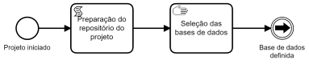

# Análise das contratações no Estado de Santa Catarina

**Autor:**

 [Maurício Vasconcellos Leão Lyrio, Dr.](https://br.linkedin.com/in/maurício-vasconcellos-leão-lyrio-59773220)

## Descrição do projeto

## Fontes de dados

## Stack de análise

### Linguagem de programação

Versão da linguagem [Python](https://www.python.org/) utilizada neste projeto: 3.8.5

Arquitetura do [Jupyter Notebook](https://jupyter.org/) utilizada neste projeto: 64bit

#### Bibliotecas utilizadas

***Para manipulação de dados***

**[Pandas:](https://pandas.pydata.org/)** A biblioteca pandas é uma ferramenta essencial para manipulação e análise de dados em Python. Ela possibilita a organização e manipulação de dados tabulares de maneira intuitiva, bem como operações de limpeza, transformação e agregação de dados, além de lidar com valores ausentes.

**[NumPy:](https://numpy.org/)** NumPy é uma biblioteca Python que possibilita a manipulação eficiente de dados numéricos. Com arrays multidimensionais otimizados, possibilita cálculos matemáticos complexos. Integra-se a outras bibliotecas como Pandas e Matplotlib, tornando-se vital para análises estatísticas e científicas.

***Para geração de visualizações e insights estatísticos***

**[Matplotlib:](https://matplotlib.org/)** Matplotlib é uma biblioteca Python para visualização de dados e criação de gráficos de alta qualidade. Ela oferece uma ampla gama de estilos gráficos e tipos de gráficos, desde gráficos de linhas simples até mapas de calor complexos.

**[Seaborn:](https://seaborn.pydata.org/)** O Seaborn é uma biblioteca Python que estende o Matplotlib, permitindo a criação simplificada de gráficos estatísticos atraentes. Com estilos predefinidos e paletas de cores, é ideal para explorar relações e padrões em dados, facilitando a visualização e interpretação de insights estatísticos.

***Outras bibliotecas***

**Warnings:** A biblioteca warnings em Python é usada para controlar a exibição de avisos durante a execução do código. Ela permite aos programadores gerenciar alertas sobre práticas desencorajadas, mudanças de comportamento ou outras situações potencialmente problemáticas.

### Toolkit de análise

#### Para compartilhamento de código-fonte

#### Para pré-processamento de dados

#### Para visualização de dados

### Banco de dados

[Jupyter Notebook 01: Carga e preparação inicial dos dados](Documents/Fornecedores.pdf)

**Referências:**

[Duan, H. K., Hu, H., Vasarhelyi, M., Rosa, F. S., & Leão Lyrio, M. V. (2020). ***Open Government Data (OGD) driven decision aid:*** a predictive model to monitor COVID-19 and support decisions in a Brazilian State. Revista Do Serviço Público, 71, 140-164. https://doi.org/10.21874/rsp.v71i0.5009](https://revista.enap.gov.br/index.php/RSP/article/view/5009)