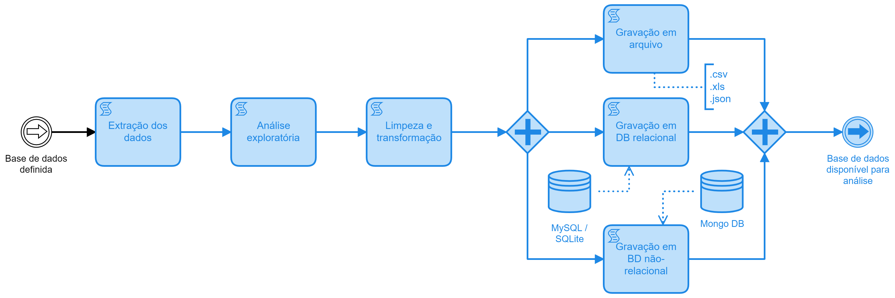

  

# Análise das contratações no Estado de Santa Catarina

**Autor:**
 [Maurício Vasconcellos Leão Lyrio](https://br.linkedin.com/in/maurício-vasconcellos-leão-lyrio-59773220)

## Descrição do projeto

Esse projeto foi desenvolvido como um case de análise de dados e utilizado como apoio à disciplina ***Data Analytics aplicado ao ensino e pesquisa em contabilidade***, ministrada no âmbito do Departamento de Ciências Contábeis da Universidade Federal de Santa Catarina.

Tem por objetivo desenvolver um dashboard com informações sobre os contratos estabelecidos pelo Poder Executivo do Estado de Santa Catarina e apresentar aos alunos um processo passo-a-passo para desenvolvimento de um projeto de analytics, bem como apresentar os conceitos de dados abertos governamentais e o procedimento de solicitação de dados via Lei de Acesso à Informação.

Além disso, busca desenvolver o entendimento de pesquisa replicável, no sentido mostrar uma forma de documentar os procedimentos utilizados no decorrer do desenvolvimento de um projeto de pesquisa afim de possibilitar sua replicabilidade e evolução ao longo do tempo.

*Obs.: É importante notar que este dashboard foi desenvolvido utilizando dados públicos, e embora tenhamos feito todos os esforços para garantir a precisão das informações, não submetemos o protótipo a um processo formal de validação ou auditoria. Ademais, reconhecemos a possibilidade de que alguns valores possam conter imprecisões devido ao processo de transformação dos dados ou a eventuais inconsistências na base de dados original. Recomendamos cautela ao interpretar os resultados e sugerimos que qualquer análise crítica leve em consideração a natureza preliminar desta visualização, sujeita a ajustes posteriores.*

## Fontes de dados

Os dados referentes aos [contratos](https://dados.sc.gov.br/dataset/contratos) estabelecidos pelo PE de Santa Catarina foram obtidos junto ao [Portal de Dados Abertos do Estado de Santa Catarina](https://dados.sc.gov.br/), abrangendo o período de 2011 a 2022.

Os dados referentes aos fornecedores do Estado foram obtidos por meio de solicitação via Lei de Acesso à Informação (solicitação nº 15.831/2023, de 14 de Junho de 2023) e recebidos em 15/06/2023 (sendo essa a data de atualização do dataset). O modelo de solicitação de informação utilizado no projeto está disponível na pasta de documentos.

## Linguagem de programação

Versão da linguagem [Python](https://www.python.org/) utilizada neste projeto: 3.8.5

### Bibliotecas utilizadas

***Para manipulação de dados***

**[Pandas:](https://pandas.pydata.org/)** A biblioteca pandas é uma ferramenta essencial para manipulação e análise de dados em Python. Ela possibilita a organização e manipulação de dados tabulares de maneira intuitiva, bem como operações de limpeza, transformação e agregação de dados, além de lidar com valores ausentes.

***Outras bibliotecas***

**Warnings:** A biblioteca warnings em Python é usada para controlar a exibição de avisos durante a execução do código. Ela permite aos programadores gerenciar alertas sobre práticas desencorajadas, mudanças de comportamento ou outras situações potencialmente problemáticas.

## Toolkit de análise

### Para compartilhamento de código-fonte

Foi utilizado o [GitHub](https://github.com/) para compartilhamento de código-fonte. O GitHub é uma plataforma de hospedagem de código-fonte e colaboração que usa o Git para rastrear versões. Ele permite compartilhar projetos, coordenar equipes, revisar código e gerenciar problemas, facilitando o desenvolvimento de software colaborativo e o controle de versão eficiente.

### Para pré-processamento de dados

Foi utilizado o Jupyter Notebook como interpretador da linguagem Python. O Jupyter Notebook é uma aplicação web de código aberto que permite criar e compartilhar documentos interativos contendo código, visualizações e textos explicativos. Ele suporta várias linguagens de programação e oferece um ambiente flexível para análise de dados, modelagem estatística e exploração de ideias, combinando códigos executáveis, saídas visuais e documentação em um único ambiente colaborativo.

Arquitetura do [Jupyter Notebook](https://jupyter.org/) utilizada neste projeto: 64bit

### Para visualização de dados

Foi utilizada como ferramenta de visualização de dados o [Microsoft Power BI](https://powerbi.microsoft.com/pt-br/). O Power BI é uma plataforma de análise de dados desenvolvida pela Microsoft que permite a criação de painéis interativos, relatórios e visualizações de dados. Ele integra-se a várias fontes de dados e oferece recursos de transformação, modelagem e análise avançada. 

### Banco de dados

Nesse projeto foi utilizado o [SQLite](https://www.sqlite.org/index.html) para persistência de dados. O SQLite é um sistema de gerenciamento de banco de dados (DBMS) leve e embutido, amplamente utilizado em aplicativos para armazenar e recuperar informações. Ele não requer um servidor separado, pois opera diretamente a partir de um único arquivo, facilitando a implementação.

## Processo de análise de dados

Para fins didáticos o projeto foi dividido em 4 fases, a saber: (i) Preparação do projeto; (ii) pré-processamento; (iii) elaboração de relatório; e, (iv) Finalização do projeto.

A fase de **preparação do projeto** consistiu em definir o problema de pesquisa, identificar as fontes de dados e configurar o repositório do projeto.

  

A fase de **pré-processamento** consistiu em extrair os dados da fonte original e realizar a preparação dos datasets para análise e visualização. Nessa fase do projeto foi utilizada a linguagem Python em interpretador Jupyter Notebook. Essa fase é concluída com a disponibilização dos datasets para análise e seu armazenamento em banco de dados.

  

A fase de **elaboração de relatório** consistiu em gerar um painel de monitoramento utilizando Power BI e publicá-lo na Internet.

  

Finalmente, a fase de **finalização do projeto** consistiu em revisar o repositório do projeto e publicá-lo na plataforma GitHub para fins de compartilhamento de código-fonte.

  

## [Link para o dashboard](https://app.powerbi.com/view?r=eyJrIjoiOTQxYjhlMDYtNDNkNS00MzlhLThiMmMtMDdiOTkwZGY1YzIyIiwidCI6ImM5MjM4Y2QwLTI2ZmYtNGU1My1iZTUxLTcyZjI0NWExZjUxYyJ9){:target="_blank"}

## <a href="https://app.powerbi.com/view?r=eyJrIjoiOTQxYjhlMDYtNDNkNS00MzlhLThiMmMtMDdiOTkwZGY1YzIyIiwidCI6ImM5MjM4Y2QwLTI2ZmYtNGU1My1iZTUxLTcyZjI0NWExZjUxYyJ9" target="_blank">Link para o dashboard</a>
